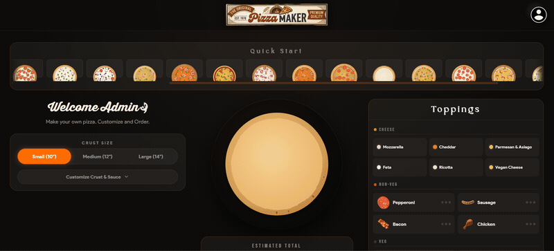

# PizzaMaker

Full-stack pizza ordering app with a **live, what-you-see-is-what-you-get pizza builder** — toppings drop onto the pie in real time as you customise, and the exact pizza you build is the one shown on your order confirmation and in your order history.

React + Vite frontend, Spring Boot REST backend.



**New here?** Start with the [Project Guide](docs/PROJECT_GUIDE.md) — a guided tour of what
is where and what does what. [ARCHITECTURE.md](ARCHITECTURE.md) is the formal design
write-up.

---

## Features

- **Live pizza builder** — an SVG pizza assembled in real time from your selections. Toppings are placed with a phyllotaxis (sunflower) distribution for an even, natural spread, and animate on/off the pie with Framer Motion as you toggle them.
- **WYSIWYG end to end** — the same `PizzaCanvas` renders the builder, the order-confirmation modal, and the order-history thumbnails, so what you build is exactly what you order and what you see served.
- **Pizzas get names, not lists** — your toppings are read for their character and named accordingly ("The Carnivore", "Garden Party", "Blazing Kitchen Sink") from a pool of ~1,950 deterministic names. Don't like it? Rename it inline; your name is saved with the order.
- **Slice-to-checkout animation** — clicking Order cuts the pizza into 4/6/8 wedges (by size); on checkout it rotates, slices apart and reassembles in a loop, with toppings cut cleanly by each slice edge.
- **Auth** — standard accounts, guest checkout, and an admin role, all JWT-backed, with a full account menu (identity, quick links, admin-gated actions).
- **Event-driven order pipeline** — an order is placed, and then cooks itself: a Kafka consumer walks it `PENDING → CONFIRMED → PREPARING → READY`, pushing each change to the customer's browser as it happens.
- **Live order status** — updates pushed over STOMP/WebSocket to that one customer, reflected in the UI without a refresh.
- **Cold-start-aware UX** — a keep-warm cron plus a branded "Firing up the oven" overlay make the free-tier backend's wake-up read as intentional rather than broken.
- **Resilient UI** — top-level error boundary and a styled 404 fallback instead of blank screens.

---

## Architecture

The load-bearing idea: **the order row and the "order placed" event are written in the same
database transaction.** Kafka is fed from that table, never directly from the request
thread — so the event log can never disagree with the database.

```
  BROWSER                            SPRING BOOT API                        DATA
┌──────────────┐
│  React 18    │── POST /api/v1/orders ──┐
│  Redux · Vite│      (JWT bearer)       │
└──────────────┘                         ▼
       ▲                    ┌─────────────────────────┐
       │                    │  OrderService           │   ┌──────────────────────┐
       │                    │    .placeOrder()        │──►│  ONE TRANSACTION     │
       │                    │                         │   │  ─────────────────   │
       │                    │  price server-side,     │   │  orders              │
       │                    │  validate toppings,     │   │  order_line_items    │
       │                    │  idempotency key        │   │  order_status_history│
       │                    └─────────────────────────┘   │  outbox_event    ◄───┼── the trick
       │                                                  └──────────┬───────────┘
       │                                                             │
       │                    ┌─────────────────────────┐              │
       │                    │  OutboxRelay            │◄─────────────┘
       │                    │   @Scheduled, every 2s  │  claims PENDING rows
       │                    │   SKIP LOCKED           │  (parallel-safe across pods)
       │                    └───────────┬─────────────┘
       │                                │ publish, keyed by orderId
       │                                ▼
       │                    ╔═════════════════════════╗
       │                    ║         KAFKA           ║
       │                    ║  orders.placed          ║
       │                    ║  orders.lifecycle       ║──┐ self-perpetuating:
       │                    ║  orders.status-changed  ║  │ each stage emits
       │                    ║  *.DLT                  ║◄─┘ the next one
       │                    ╚═══╤═════════════════╤═══╝
       │                        │                 │
       │        ┌───────────────▼──────┐   ┌──────▼────────────────────┐
       │        │ OrderLifecycleListener│   │ OrderStatusBroadcast      │
       │        │  ── the kitchen ──    │   │        Listener           │
       │        │  PENDING → CONFIRMED  │   │  unique consumer group    │
       │        │  → PREPARING → READY  │   │  PER POD (broadcast)      │
       │        │  shared group         │   └──────────┬────────────────┘
       │        │  (competing consumers)│              │
       │        └───────────────────────┘              │
       │                                               │
       └────────── STOMP / SockJS push ────────────────┘
                  /user/queue/orders
```

**Why the outbox instead of `kafkaTemplate.send()` in `placeOrder()`?** Because that's a
dual write to two systems with no shared transaction. The process can die between the two
calls: send-then-crash cooks a pizza for an order that doesn't exist; commit-then-fail
charges a customer and does nothing. Writing the event *as a row, in the same transaction*
removes the window entirely.

**Why key every message by order id?** Kafka only guarantees ordering within a partition,
and the key picks the partition. Unkeyed, a customer could see `READY` before `PREPARING`.

**Why does the status-push consumer get its own group per pod?** `enableSimpleBroker()` is
an in-memory STOMP broker, so a pod can only push to sockets it personally holds. With a
shared group, Kafka would hand each status change to one pod — usually not the one holding
that customer's socket — and the push would silently vanish at `replicas > 1`. A per-pod
group makes it a broadcast: every pod sees every change and pushes to whoever it's holding.
(The at-scale answer is `enableStompBrokerRelay()` with RabbitMQ; deliberately not built, to
avoid running a second broker for a demo.)

---

## Tech Stack — full reference

> Single source of truth for every tool, library and service in the project. Keep this
> updated whenever a new dependency or module is added, so nobody has to spelunk the code
> to know what's in use.

### Frontend

| Tool | Version | Role |
| --- | --- | --- |
| React | 18.3 | UI |
| Redux Toolkit + react-redux | 1.6 / 7.2 | State management |
| React Router | 5.2 | Client-side routing |
| Vite | 5.4 | Dev server + build |
| Framer Motion | 12 | Animation (SVG pizza, slice, overlays) |
| Axios | 1.x | HTTP client (JWT + warm-up interceptors) |
| @stomp/stompjs + sockjs-client | 6.1 / 1.6 | WebSocket / STOMP live updates |
| lucide-react | icons | Menu + UI icons |
| react-hot-toast | toasts | Notifications |
| Vitest | 2.1 | Frontend tests |

### Backend

| Tool | Version | Role |
| --- | --- | --- |
| Java | 21 (LTS) | Language |
| Spring Boot | 3.3.5 | Framework (web, data-jpa, security, validation, actuator, websocket, aop) |
| Spring Security + jjwt | 6 / 0.12.3 | Stateless JWT auth |
| Spring Data JPA + Hibernate | — | Persistence |
| H2 / PostgreSQL | — / 16 | DB (dev / prod) |
| Flyway | — | Versioned schema migrations |
| Spring Kafka | — | Event pipeline (KRaft, no Zookeeper) |
| Resilience4j | 2.2 | Retry + circuit breaker |
| Bucket4j | 8.10 | Auth rate limiting |
| springdoc-openapi | 2.6 | Swagger UI / OpenAPI |
| Micrometer + Prometheus | — | Metrics (`/actuator/prometheus`) |
| logstash-logback-encoder | 8.0 | Structured JSON logs (prod) |
| Lombok | — | Boilerplate reduction |

### Patterns & subsystems (project-specific)

| Name | Where | What |
| --- | --- | --- |
| Transactional Outbox | `outbox/` | Atomic order + event write; kills the dual-write problem |
| Kafka lifecycle pipeline | `messaging/` | Self-perpetuating `PENDING→CONFIRMED→PREPARING→READY`, DLT, per-pod broadcast |
| Pizza name generator | `src/utils/pizzaName.js` | Trait-based deterministic naming (~1,950 names) |
| Cold-start warm-up | `src/api/warmup.js`, `WarmupOverlay` | "Firing up the oven" overlay for slow requests |
| Idempotent ordering | `Idempotency-Key` header + unique index | Double-click / retry safe |

### Infra, CI/CD & hosting

| Tool | Role |
| --- | --- |
| Docker + docker-compose | Local full stack (Postgres + Kafka + app) |
| Kubernetes + Helm | Multi-replica deploy (minikube-ready), `k8s/` + `helm/` |
| GitHub Actions | CI (`ci.yml`) + keep-warm cron (`keep-warm.yml`) |
| Cloudflare Pages | Frontend hosting (`pizzamaker.pages.dev`) |
| Render | Backend web service (free tier, kept awake by the keep-warm cron) |
| Neon | Managed Postgres — **free-forever** serverless (`DATABASE_URL`) |
| Maven (+ wrapper) | Backend build |

### Testing

JUnit 5 · Mockito · MockMvc · spring-security-test · **EmbeddedKafka** (spring-kafka-test) · **Testcontainers** (real Postgres) · Vitest (frontend)

### Fonts

Bebas Neue (`--font-caps`) · Product Sans (`--font`) · **Ketchup Manis** (`--font-brand`, pizza names + hero) · Bourbon

---

## Prerequisites

- **Java 21 (LTS)** — [Eclipse Temurin](https://adoptium.net/) recommended
- **Node.js 18+** — [nodejs.org](https://nodejs.org/)
- Maven is bundled via the wrapper (`mvnw.cmd`) — no install needed
- *Optional:* Docker (for the Kafka stack), minikube + Helm (for the Kubernetes path)

---

## How to Run Locally

### 1. Clone and set up env

```bash
git clone https://github.com/udaykt/PizzaMaker.git
cd PizzaMaker
cp .env.example .env          # already pre-filled for local dev
```

### 2. Start the backend (Spring Boot + H2)

Open a terminal in the `backend/` folder:

```bash
# Windows (PowerShell)
cd backend
.\mvnw.cmd spring-boot:run

# macOS / Linux
cd backend
./mvnw spring-boot:run
```

Wait for the line:

```
Started PizzaMakerApplication in X seconds
```

Available at:

- API: http://localhost:8080
- Swagger UI: http://localhost:8080/swagger-ui.html
- H2 Console: http://localhost:8080/h2-console (JDBC URL: `jdbc:h2:mem:pizzadb`)
- Health: http://localhost:8080/actuator/health

### 3. Start the frontend (Vite dev server)

Open a **second** terminal in the project root:

```bash
npm install
npm run dev
```

App opens at **http://localhost:3000**

---

## Run with Kafka (docker-compose)

The steps above run **without a broker**: `app.kafka.enabled` defaults to `false`, the outbox
dispatches in-process, and orders stay `PENDING` until an admin advances them. That's a
supported mode — it's what keeps `git clone && mvnw spring-boot:run` working with zero setup.

To get the **full event-driven pipeline**, where an order cooks itself:

```bash
cp .env.example .env      # set DOCKER_DB_PASSWORD and JWT_SECRET
docker compose up --build
```

That brings up:

| Service | Port | Notes |
| --- | --- | --- |
| `db` | 5432 | PostgreSQL 16 |
| `kafka` | 9092 | Single-node, **KRaft mode** — no Zookeeper |
| `backend` | 8080 | Starts with `KAFKA_ENABLED=true` |
| `frontend` | 3000 | nginx |

Place an order, then watch it walk itself through the lifecycle:

```bash
docker compose logs -f backend | grep "status"
```

```
Order 8f3c… status PENDING -> CONFIRMED
Order 8f3c… status CONFIRMED -> PREPARING
Order 8f3c… status PREPARING -> READY
```

Each of those lines is a separate Kafka message, and each one is pushed to the customer's
browser over STOMP as it happens. Nobody touched the admin endpoint.

Inspect the topics:

```bash
docker compose exec kafka kafka-topics.sh --bootstrap-server localhost:9092 --list
docker compose exec kafka kafka-console-consumer.sh \
  --bootstrap-server localhost:9092 --topic orders.placed --from-beginning
```

---

## Run on Kubernetes (minikube)

```bash
# 1. Start the cluster WITH HEADROOM.
#    Kafka is a JVM and wants ~1GB. On minikube's default 2GB it gets OOMKilled and
#    you get a CrashLoopBackOff with no useful log line.
minikube start --memory=4096 --cpus=4

# 2. Build the image.
cd backend && docker build -t pizzamaker-api:local . && cd ..

# 3. Side-load it into minikube's docker daemon.
#    (This is why imagePullPolicy is Never — there is no registry to pull from.)
minikube image load pizzamaker-api:local

# 4. Bring up Postgres + Kafka.
kubectl apply -f k8s/deps/
kubectl wait --for=condition=ready pod -l app=kafka --timeout=180s

# 5. Install the chart.
helm install pizzamaker ./helm/pizzamaker

# 6. Get a URL.
minikube service pizzamaker-pizzamaker --url
```

Watch two pods each pick up work:

```bash
kubectl get pods -w
kubectl logs -l app.kubernetes.io/name=pizzamaker -f --prefix
```

Prefer raw manifests over Helm? `kubectl apply -f k8s/` does the same thing.

Tear down: `helm uninstall pizzamaker && kubectl delete -f k8s/deps/`

### Overriding the demo secrets

`values.yaml` ships demo secrets so a fresh `helm install` works with no arguments. **A
Kubernetes Secret is base64, not encryption.** For anything real:

```bash
helm install pizzamaker ./helm/pizzamaker \
  --set secrets.jwtSecret="$(openssl rand -base64 32)" \
  --set secrets.databasePassword="$(openssl rand -base64 24)"
```

---

## Database on Neon (production, free forever)

Production Postgres runs on **[Neon](https://neon.tech)** — serverless, free-forever
(0.5 GB, autosuspends, wakes in ~1s). Render's own free Postgres is deleted after 90
days, so the database deliberately lives off Render. The backend reaches it through a
single `DATABASE_URL`, and `application-prod.yml` prefers that variable when present — so
this is **config only, no code change**.

**One-time setup (~5 min):**

1. [neon.tech](https://neon.tech) → sign up → **New Project** (`pizzamaker`).
2. Copy the connection string and put it in JDBC form:
   ```
   jdbc:postgresql://ep-xxx-pooler.<region>.aws.neon.tech/neondb?sslmode=require
   ```
3. In the Render backend → **Environment**, set (these are the `sync: false` keys in
   [`render.yaml`](render.yaml)):
   | Key | Value |
   | --- | --- |
   | `DATABASE_URL` | the JDBC URL above |
   | `DATABASE_USERNAME` | Neon user |
   | `DATABASE_PASSWORD` | Neon password |
4. Redeploy. **Flyway recreates the schema on first boot** and `DataSeeder` re-adds the
   admin user — nothing to migrate for a fresh start.

**Keeping existing data** (optional): before the Render database is suspended, copy it
over once:

```bash
pg_dump "<old-render-internal-connection-string>" \
  | psql "<neon-connection-string>"
```

The whole hosted stack is then free-forever: **Neon** (DB) · **Render** free web service
(API, kept awake by [`.github/workflows/keep-warm.yml`](.github/workflows/keep-warm.yml)) ·
**Cloudflare Pages** (frontend).

---

## Run tests

**Backend** (JUnit 5 + Mockito + EmbeddedKafka):

```bash
cd backend
.\mvnw.cmd test     # Windows (PowerShell)
./mvnw test         # macOS / Linux
```

No broker needed — the Kafka tests spin up an in-JVM one (`@EmbeddedKafka`). They cover the
producer, the lifecycle consumer, idempotent handling of a redelivered message, and
dead-letter routing.

```bash
./mvnw verify                          # includes the Testcontainers Postgres test (needs Docker)
./mvnw verify -DexcludedGroups=docker  # what CI runs
```

**Frontend** (Vitest — placement engine, order mapping, store reducers):

```bash
npm test            # run once
npm run test:watch  # watch mode
```

---

## API Endpoints

| Method | Path                          | Auth   | Description                         |
| ------ | ----------------------------- | ------ | ----------------------------------- |
| POST   | `/api/v1/auth/register`       | Public | Register standard user, returns JWT |
| POST   | `/api/v1/auth/login`          | Public | Login, returns JWT                  |
| POST   | `/api/v1/auth/guest`          | Public | Register guest user, returns JWT    |
| GET    | `/api/v1/menu/toppings`       | Public | List available toppings             |
| GET    | `/api/v1/menu/sizes`          | Public | List sizes with pricing             |
| GET    | `/api/v1/users/me`            | User   | Get current user profile            |
| POST   | `/api/v1/orders`              | User   | Place a new order                   |
| GET    | `/api/v1/orders/my`           | User   | Get own orders (paginated)          |
| GET    | `/api/v1/orders/{oid}`        | User   | Get specific order                  |
| GET    | `/api/v1/orders`              | Admin  | Get all orders (paginated)          |
| PUT    | `/api/v1/orders/{oid}/status` | Admin  | Update order status                 |
| GET    | `/actuator/health`            | Public | Health check                        |

Pagination params: `?page=0&size=10&sort=createdAt,desc`

---

## Design Patterns

| Pattern                     | Where                                                    | Why                                                         |
| --------------------------- | -------------------------------------------------------- | ----------------------------------------------------------- |
| **Repository**              | `UserRepository`, `OrderRepository`                      | Decouples data access from business logic; easy to swap DB  |
| **DTO / Mapper**            | `*Request`, `*Response`, `UserMapper`, `OrderMapper`     | Prevents entity leakage to API layer; stable API contract   |
| **Chain of Responsibility** | Spring Security filter chain → `JwtAuthenticationFilter` | Each filter handles one concern, passes to next             |
| **Strategy**                | `PasswordEncoder` (BCrypt injected via DI)               | Swap hashing algorithm without changing callers             |
| **Facade**                  | `AuthService` (wraps repo + JWT + encoder)               | Single entry point hides multi-step auth flow               |
| **Decorator**               | `@Async` on `NotificationService`                        | Adds async behaviour without modifying business logic       |
| **Template Method**         | `OncePerRequestFilter` in `JwtAuthenticationFilter`      | Framework calls `doFilterInternal`; subclass fills the step |

---

## Security Notes

- Passwords are BCrypt-hashed and only the hash is stored — the app never persists plaintext credentials.
- JWT secret must be a Base64-encoded 256-bit key in production (set via `JWT_SECRET` env var).
- The dev secret in `application.yml` is for local use only — never commit a real secret.
- Guest users have `null` password hash; they authenticate only via JWT (no password endpoint).
